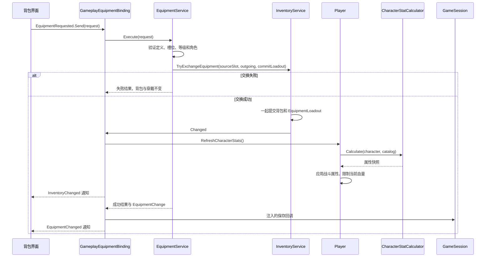

# 装备系统架构

装备服务、背包交换与界面已接入。单击背包装备打开“装备 / 出售”菜单，点击穿戴槽打开“卸下”菜单；悬停两种格子均显示所选实例的详细属性。物品类别与自定义操作见 [ItemActions.md](ItemActions.md)。
请求与通知采用 Godot 资源通道，资源位于 `GameData/Events`；完整接口与生命周期说明见 [EventSystem.md](EventSystem.md)。

## 职责与调用顺序

| 文件 | 职责 |
| --- | --- |
| `Equipment/EquipmentDefinition.cs` | 继承物品资源；定义槽位、角色/等级限制、展示元数据和全部属性加成。子类可重写 `CanEquip`、`GetStatBonuses`。 |
| `Character/EquipmentLoadout.cs` | 可存档的七个槽位，每个槽位保存拥有的装备实例。 |
| `Equipment/EquipmentInstance.cs` | 唯一实例 ID、定义 ID 与不可变宝石孔数据。 |
| `Equipment/EquipmentService.cs` | 校验穿戴条件与真实格子，统一提交背包和槽位，返回明确结果。 |
| `Equipment/GameplayEquipmentBinding.cs` | 连接唯一请求处理者、应用属性、发布通知和保存；离场解除连接。 |
| `Actors/Player.cs` | 重算并应用战斗属性，不管理存档或穿戴请求。 |
| `Character/CharacterStatCalculator.cs` | 汇总基础、永久、装备来源，每次生成独立快照，不向基础属性累计装备数值。 |



关卡的装配方式（离场时释放 binding）：

```csharp
player.BindCharacter(character, catalog);
var binding = new GameplayEquipmentBinding(character, catalog, inventory, events,
    player.RefreshCharacterStats, () => GameSession.Save(inventory), GameSession.Data!.Wallet);
events.EquipmentRequested.Send(new EquipmentRequest(EquipmentAction.Equip, slotIndex, selectedInstance.InstanceId));
```

## 本轮确定的约束

- 同款不同实例允许换装；旧格子/旧实例选择被拒绝，空槽重复卸下不刷新或写盘。
- 穿戴服务不依赖人物节点、动画、背包 UI 或静态存档入口；保存由关卡注入装配层。
- 装备增减最大生命只限制当前生命上限，不自动回血或复活。最大魔法和恢复属性保留在计算快照中，运行时魔法/自动恢复尚未接入。
- 存档保存槽位及基础数据，最终属性由加载后的定义重新计算。不要同时存一份可失效的派生属性。
- `TryExchangeEquipment` 在副本上检查空间，统一提交后才通知；不能连续拼接两个独立背包操作。
- 写盘失败通过 `SaveFailed` 单独通知，此时内存装备仍然生效，不自动回滚或重试。
- 背包与槽位直接拥有实例数据，交换不会重新生成实例 ID。宝石随实例保存；强化、随机词条尚未实现，不预造字段或数值。
- 六件现有武器资源已继承新基类，展示元数据来自旧版 `AllEquipment.gd`；普通行者棍仍沿用当前固定攻击 4，旧版随机攻击没有迁入。

## 属性注册

`CharacterStatRegistry` 是展示注册表，不会通过反射自动扫描人物字段。默认注册十六项，后续按稳定 ID 增加或替换，注册变化会刷新已绑定的面板。

```csharp
var registry = CharacterStatRegistry.CreateDefault();
registry.Register(new("new_stat", "新属性", stats => stats.Attack));
// 同 ID 替换，位置保持不变；无需修改 Presenter。
registry.Register(new("new_stat", "新属性", stats => stats.Attack,
    (value, player) => $"{value:0.##}"));
registry.Unregister("new_stat");
// 将 registry 作为 LegacyBackpackView 构造函数的末尾参数注入，
// 或通过已有 view.StatRegistry 注册。
```

每页十项，注册顺序决定顺序；超过二十项继续分页。两个旧页码按钮负责上一页、下一页，超过两页时覆盖为箭头，悬停显示当前页/总页数。一次面板刷新只计算一次人物属性。
该注册表只控制展示，不会自动增加存档字段或战斗属性；新增实际游戏属性还需扩展数据模型与计算逻辑。

## 说明面板与验证

`LegacyItemTooltip` 实例化旧版 `equipment_properies.tscn`，复用字体、颜色和逐行布局。品质/类型/所属、描述和售价读取定义；属性包含所选实例的宝石加成，孔位显示空孔或宝石名称。未实现的五行与成长条目隐藏。说明框紧贴当前物品格子右侧，顶部与格子对齐；右侧空间不足时缩窄并自动换行，不翻到左边。后续排版尺寸变化时同步调整背景与纵向位置。

`Tests/EquipmentArchitectureSmokeTest.cs` 使用真实背包交换、新装配层和内存序列化，检查失败不提交、旧选择拒绝、人物先更新再保存、装备属性汇总、三页注册及旧说明场景。装备测试数据不写入玩家存档；启动关卡时会准备存档，应在独立用户目录运行。

运行：Godot 启动 `Scenes/TestArena.tscn`，附加参数 `--equipment-architecture-test`。

事件系统接入后的验证：构建零警告/错误，背包与存档逻辑、装备事件交互、装备架构及关卡背包测试通过。装备事件测试使用真实背包信号验证点击菜单穿戴、槽位卸下、属性刷新与订阅释放；保存失败路径主动注入写盘异常，验证内存状态保留及失败通知。
