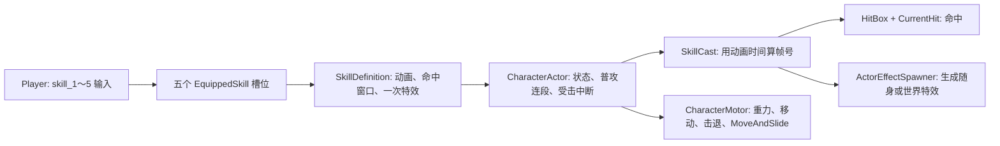

# 技能系统现状与角色位移方案（供审阅）

> 2026-09-26 的实施前评估，保留问题成因和旧版对照供查阅。动作位移现已按方案接入；下面的“当前行为”指实施前状态。实际实现和配置见 [动作位移实现说明](ActionMotionImplementation.md)。烈焰风暴分身与技能命中配置仍未实施。

## 先说结论

1. **烈焰风暴的贴图和 SpriteFrames 没丢，原先是播放链断了。** 旧角色 `lyfb` 动画第 0 帧对 `Action/SpecialEffect` 调用 `play("lyfb")`；迁移后的玩家动画缺少播放轨道，还把 `Facing/Visual/SpecialEffect` 隐藏。本次已在当前 `lyfb` 时间轴上恢复本体火焰逐帧显示和结束隐藏。旧项目的分身还能播放另一份烈焰风暴特效；分身场景和触发逻辑仍未接入当前玩家。
2. **当前所有攻击状态的水平输入速度都变成 0。** `CharacterActor` 只在 `Free` 时读移动输入，并在 `Attacking` 时向 `CharacterMotor` 传 0；`CharacterMotor` 每帧重写水平速度。于是奔跑中起普攻会立刻停下，跳起后普攻也会失去水平惯性，烈焰闪虽然播动画，却不会带角色冲刺。
3. **旧版跳跃首段普攻保留的是入招前的水平惯性，不是持续响应方向键。** 悟空 `hit1` 里的 `is_can_move_attack_in_sky()` 只有“已经在攻击中且站在地面”才清零；正常开始 `hit1` 时 `is_attacking` 尚未置为 `true`，所以原有 `velocity.x` 留下。攻击期间普通输入控制关闭，但 `move_and_slide()` 仍每帧使用该速度。`hit2`～`hit4` 明确把水平速度置 0。这与“空中攻击有一小段位移”的感受一致，但旧代码本身没有给 `hit1` 施加固定的小冲量。
4. **建议把角色位移作为动作的配置数据，由物理移动组件执行。** 普攻段与技能共用一套轻量的位移规则；动画只管视觉，特效只管表现或独立命中体。先还原“保留惯性”和“定速冲刺”，再按手感增加分段曲线，不必一开始做复杂编辑器。

## 烈焰风暴：具体断在哪里

| 层次 | 旧项目 | 当前重构项目 | 判断 |
| --- | --- | --- | --- |
| 贴图 | `Art/HeroPicture/Role1SpecialEffect/Role1LYFB.png` | `Assets/Art/HeroPicture/Role1SpecialEffect/Role1LYFB.png` 存在，`Player.tscn` 也引用了它 | 资源文件存在 |
| 角色本体火焰 | `Role1.tscn` 的 `lyfb` 动画有方法轨道，调用 `Action/SpecialEffect.play("lyfb")` | 本次在 `Player.tscn` 的 `anim_lyfb` 改为由时间轴直接设置 `lyfb` 帧 0～9，并控制显示/隐藏 | 原播放链缺口已补；采用明确的逐帧轨道 |
| 技能生成特效 | 旧版主体靠角色动画轨道播放，非 `EffectScene` 配置 | `SkillDefinition` 支持 `EffectScene`，但当前 `lyfb` 槽位为空 | 运行时不会另行生成 |
| 分身附加火焰 | `Role1.gd` 的 `setShallowaction("lyfb")` 令场上已有分身播放 `Role1SHallow.tscn` 的 `lyfb`；该动画还切换自身碰撞框 | `Reference/OriginalScenes/Hero/Role1SHallow.tscn` 留作参考，活动的 `Player` 没有分身协作 | 旧版附加效果也未接入 |

**结论边界：** 本次只补本体火焰，使用现成贴图和当前动画时长；没有生成独立场景。以后给 `EffectScene` 填场景时要先判断是否与本体效果重复。旧版分身不是每次烈焰风暴都新生成：其他技能或机制先生成分身，烈焰风暴再让场上已有分身同步施放。

此外，当前五个 `SkillDefinition` 都只填了 `Animation` 和 `Hit`，没有填命中起止帧；默认 `-1` 使 `SkillCast.IsHitActive` 为假。`Player.tscn` 里从旧版搬来的 `HitBox.Active` 轨道虽然仍会闪烁，但 `HitBox` 真正造成伤害还要求 `CurrentHit` 不为空。结果是这些槽位目前主要适合预览动作，**不能仅凭搬来的命中框轨道确认技能已能造成伤害**。这项配置缺口不随本体火焰的恢复而消失。

## 实施前技能系统怎么组织

| 文件/场景 | 当前职责 | 主要限制 |
| --- | --- | --- |
| `project.godot`、`Player.cs` | `skill_1`～`skill_5` 输入对应五个可替换的装备槽位；普攻键可在攻击中缓存下一段 | 技能目前不读取消耗、冷却等规则 |
| `Player.tscn` | 给五个槽位填技能资源，并保存角色各动画、精灵帧与命中框轨道 | 五个技能的命中窗口、特效场景尚未填；`lyfb` 本体火焰已恢复 |
| `SkillDefinition.cs` | 一个技能的动画名、FPS、单段命中窗口、单次特效及跟随/寿命 | 不描述角色位移；一技能只支持一个效果事件和一个命中窗口 |
| `CharacterActor.cs` | 验证技能，进入 `Attacking`，打断普攻连段，启动 `SkillCast`；受击或动画结束时清理 | 技能和普攻都被同一个 `Attacking` 状态锁住移动；技能只能在 `Free` 发起 |
| `SkillCast.cs` | 以 `AnimationPlayer.CurrentAnimationPosition × FPS` 算当前帧；在设定帧生成一次特效，按帧窗口开放共享命中框 | 未配置的窗口不命中；只处理一个持续窗口，无法直接表达烈焰风暴那样的多次命中节奏 |
| `ActorEffectSpawner.cs` | 把 `PackedScene` 挂到 `Facing` 或世界父节点，并按寿命清理 | 场景必须是 `Node2D`；弹道、分身、自带攻击判定仍需具体场景逻辑 |
| `AttackStep.cs`、`HitBox.cs` | 普攻每段的动画/伤害/可选特效；命中框记录本次攻击已命中的目标 | 普攻效果触发依赖动画方法轨道；同一次 `BeginAttack` 默认每个目标只命中一次 |
| `CharacterMotor.cs` | 根据传入的移动速度、击退、重力执行 `MoveAndSlide()` | 不保留动作开始时的水平惯性，也没有技能冲刺速度来源 |

这里还存在一个需要在后续实现时统一的**命中时间真源**：普攻主要用 `AnimationPlayer` 轨道开关 `HitBox.Active`；技能由 `SkillCast` 的帧窗口写同一个属性。旧 `lyfb` 动画带有多段开关轨道，但当前 `SkillCast` 每帧又会按单个窗口覆盖它。技能是否允许多段命中、每段能否重复命中同一目标，需要先在数据模型里定清楚。

## 旧项目与实施前位移对照

| 动作 | 旧项目观察 | 当前行为 | 建议先还原的目标 |
| --- | --- | --- | --- |
| 奔跑中首段普攻 `hit1` | 入招前的 `velocity.x` 留下；攻击中不持续接收移动输入，`move_and_slide()` 仍使用原速度 | 进入 `Attacking` 后 X 速度归零 | 保留入招速度，并按可调规则衰减或持续到指定帧；先以旧行为为基准 |
| 空中首段普攻 `hit1` | 同样保留起招前 X 速度；重力和 Y 速度继续生效 | X 立刻归零，Y 仍受重力影响 | 保留空中水平惯性；不把动画视觉偏移误当角色位移 |
| 后续普攻 `hit2`～`hit4` | 悟空脚本显式 `velocity.x = 0` | X 归零 | 默认保持原地，是否允许轻微位移再单独调手感 |
| 烈焰闪 `lys` | 悟空起招时按面向设 `velocity.x = ±1000`，普通输入控制关闭，物理更新持续移动；实际距离受动画时长、碰撞和中断影响 | 只播放约 0.333 秒的角色/火焰动画，角色水平速度为 0 | 起招方向锁定，按设定时间执行冲刺，碰墙停止或滑动由物理碰撞处理 |
| 火焰突击 `hytj` | 起招时设 `velocity.x = ±570` | 当前框架同样不提供该速度 | 同一位移能力可复用，参数不同 |
| 烈焰风暴 `lyfb` | 地面起招时 X 清零；空中未主动清零，可沿用既有惯性；本体动画加已有分身同步效果 | 攻击状态 X 归零；本体火焰已恢复，分身未接入 | 地面原地施放；空中保留还是清除惯性作为策划决定 |

**注意：** 旧版的 `is_can_move_attack_in_sky()` 名称容易误导。它的条件是 `is_on_floor() and is_attacking`，而正常 `hit1` 调用它时还没设 `is_attacking = true`。因此不能据此推断旧版设计了主动的“空中攻击推进量”；能确定的是“保留入招水平速度”。同时，旧 `Role1.gd`、`BaseHero.gd` 在物理帧中调用顺序不同，实际体感距离仍应进旧版运行对照后确认。

## 原定的位移设计

### 用一个动作说明改后的架构

按下“烈焰闪”时，`Player` 只负责把技能槽位交给 `CharacterActor`。`CharacterActor` 建立本次动作，记录**起招面向**，同时从动作配置读到“从第 0 帧到第 N 帧，按面向以某个速度冲刺”。每个物理帧，动作根据当前动画帧给出一个目标水平速度；`CharacterMotor` 用这个速度和重力执行碰撞移动。火焰精灵仍由动画控制，命中框仍由命中时间控制，二者都不直接改角色坐标。动画结束或角色受击时，本次动作结束，冲刺速度立即撤销。

对“跳跃中首段普攻”，流程相同，只是动作配置选择“继承起招前的 X 速度”而非“给固定冲刺速度”。后续普攻选择“停止”。所以普通攻击和技能可以复用同一套位移规则，每个动作只改配置，物理移动仍集中在 `CharacterMotor`。拟新增的不是另一套角色控制器，而是位于 `CharacterActor` 与 `CharacterMotor` 之间的一份动作位移数据/运行状态。

### 1. 给动作明确的水平移动规则

普攻段和技能都需要可选的动作位移配置，起步支持三种足够：

| 规则 | 用途 | 例子 |
| --- | --- | --- |
| 停止 | 动作期间不接受方向输入，水平速度清零 | 悟空 `hit2`～`hit4`、地面 `lyfb` |
| 继承惯性 | 进入动作时记住 X 速度，按可配保留时间和衰减执行 | 奔跑/跳跃时 `hit1`；空中 `lyfb` 待确认 |
| 面向冲刺 | 进入动作时记住面向，在指定动画帧区间提供水平速度 | `lys` 约 1000、`hytj` 约 570；数值先用旧版作起点 |

若后续发现单一速度段不能复现手感，再允许一个动作有多个时间段（起步、冲刺、收招）；数据仍采用帧区间，避免把速度写进每个角色的专用逻辑。暂不建议直接动画化角色根节点位置：碰撞、斜坡、墙体与受击中断应由 `CharacterBody2D.MoveAndSlide()` 处理。角色动画可以继续调整视觉子节点的偏移，不负责真实位移。

### 2. 统一每帧的速度来源与优先级

`Player` 始终采样水平输入；`CharacterActor` 决定当前动作是否允许使用它，并把“自由移动 / 保留惯性 / 动作冲刺”中的一个结果交给 `CharacterMotor`。`Motor` 仍是唯一实际写 `Velocity` 并调用 `MoveAndSlide()` 的地方。建议优先级：死亡或硬直受击（含击退）→ 动作指定冲刺 → 动作继承惯性或允许输入 → 自由移动。明确不把冲刺与自由移动速度直接相加，以免不同技能意外叠速。

起招时缓存面向与起始速度；攻击中按键是否可转向、是否可转身要由动作配置决定。先按旧版做“冲刺锁定方向，首段普攻保留入招惯性”；连段切换到 `hit2` 时重新评估规则。空中保留重力和 Y 速度，除非某个技能另有起跳、悬停或落地机制。动画暂停、变速、受击打断时位移区间应跟随同一动画时间，并立刻清除本次动作的速度来源。

### 3. 特效和命中拆开考虑

- **角色自身逐帧特效：** 例如烈焰风暴本体火焰。优先恢复 `Player.tscn` 的可见与播放轨道，由同一动画时间轴控制；不必为了显示它额外生成场景。
- **独立场景效果：** 例如弹道、范围场、分身。由技能事件生成，并由场景管理自己的动画、碰撞与寿命；旧分身可单独复原，不能把它误当本体火焰。
- **命中：** 普攻单次命中、技能单段命中、多波重复命中是不同需求。烈焰风暴旧版有多次碰撞框开启，当前 `SkillDefinition` 只有单个窗口，且 `HitBox` 会记录已命中过的目标。建议先明确每个技能是“每次释放命中一次”还是“每波可再次命中”，再扩展数据与命中记录重置方式。

### 4. 原定实施顺序

1. 先确认 `lyfb` 想保留哪些层：本体火焰已经恢复；分身联动和各自伤害次数仍待决定，并需补齐真实技能的命中帧配置。
2. 给 `AttackStep` 与 `SkillDefinition` 共用的动作位移配置；先用 `hit1` 的继承惯性、`lys` 的面向冲刺验证物理与中断。
3. 补 `hytj`、空中 `lyfb` 等差异；确定冲刺撞墙、离地、受击和连段切换时的终止规则。
4. 最后根据实测扩展多阶段位移、多波命中和独立分身效果，避免一开始把所有特例塞进 `SkillCast`。

## 需要你审阅的产品决定

1. **普攻移动手感：** 首段是否严格复刻旧版“保留起招速度”，还是改成短距离、定量推进？后续段是否继续原地？
2. **技能期间方向：** 烈焰闪冲刺期间是否允许反向输入/转身？建议先锁定起招面向。
3. **烈焰风暴效果层：** 只恢复角色本体火焰，还是连旧版“场上已有分身同步施放”一起作为重构目标？
4. **多段命中：** 烈焰风暴的一次释放是否要同一敌人吃到多波伤害？旧版轨道呈现多次开启，当前公共命中框默认一次只命中一次。

## 核对位置

- 当前本体火焰与技能槽：`Scenes/Actors/Player.tscn` 第 31～75、3334～3459、4340～4380 行；贴图：`Assets/Art/HeroPicture/Role1SpecialEffect/Role1LYFB.png`。
- 当前流程：`Scripts/Actors/Player.cs`、`CharacterActor.cs`、`CharacterMotor.cs`；配置与运行时：`Scripts/Combat/SkillDefinition.cs`、`SkillCast.cs`、`AttackStep.cs`、`HitBox.cs`；特效：`Scripts/Effects/ActorEffectSpawner.cs`。
- 旧本体动画：`Reference/OriginalScenes/Hero/Role_1/Role1.tscn` 第 9399～9600 行；旧分身动画：`Reference/OriginalScenes/Hero/Role1SHallow.tscn` 第 289～405 行。
- 旧行为代码：`F:\godot\造梦八荒-(4.1)\Script\Hero\Role1.gd` 第 202～307、558～569 行；`Script\Base\BaseHero.gd` 第 319～395、505～507 行；`Script\Hero\Role1SHallow.gd` 第 20～39 行。

上述为静态代码与资源检查；未运行旧版或改动当前游戏来量测像素位移。速度数值和视觉观感的最终对应需要游戏内对照确认。
